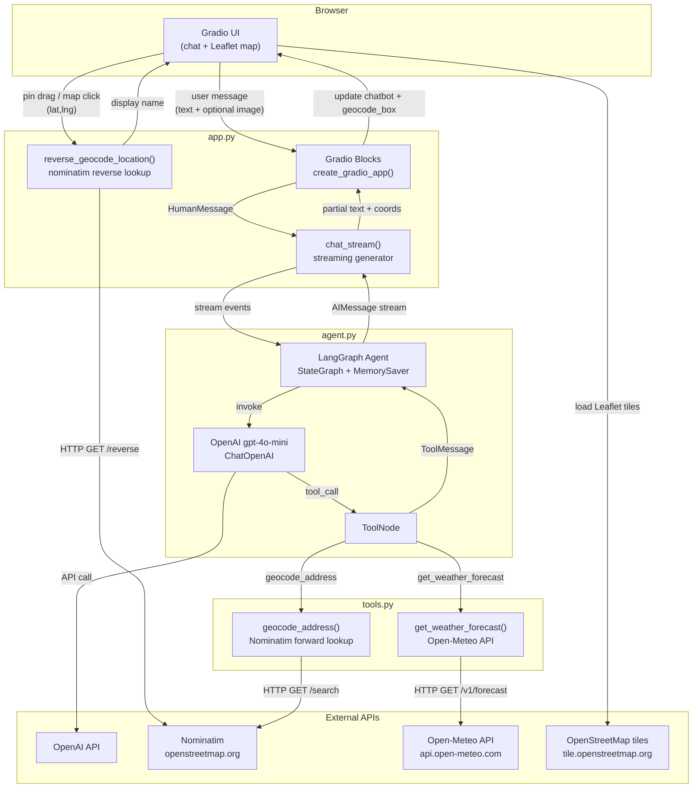
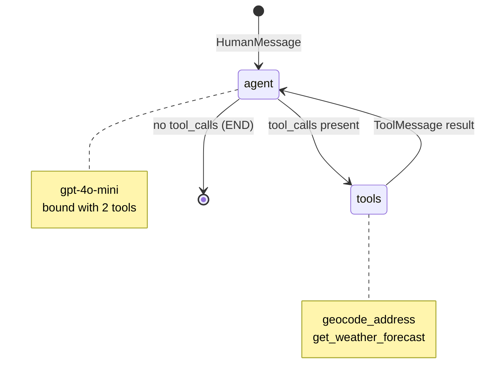
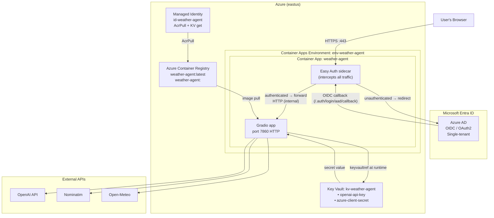
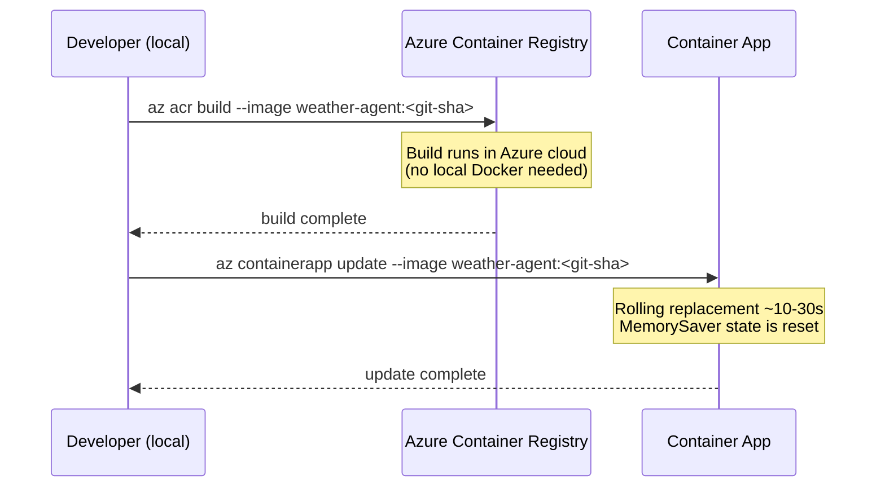

# Architecture Diagrams — Weather Agent

## Application Architecture

---

## LangGraph State Machine

---

## Deployment Architecture (Azure Container Apps + Easy Auth)

---

## Deployment Pipeline

